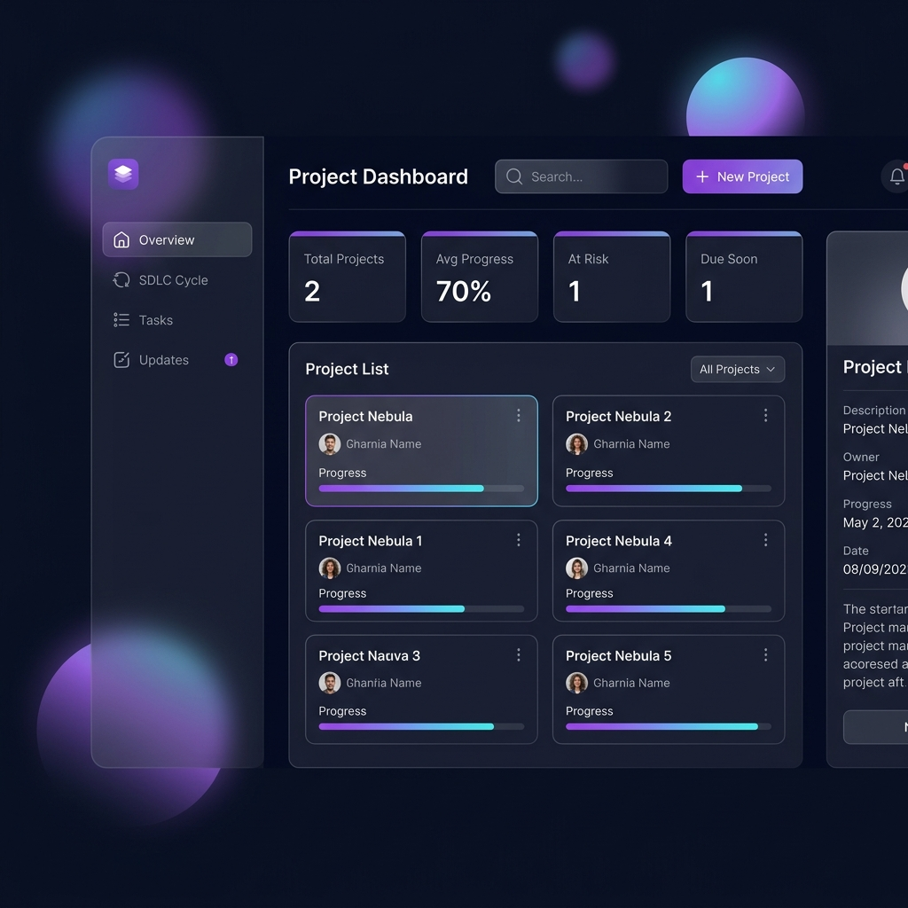
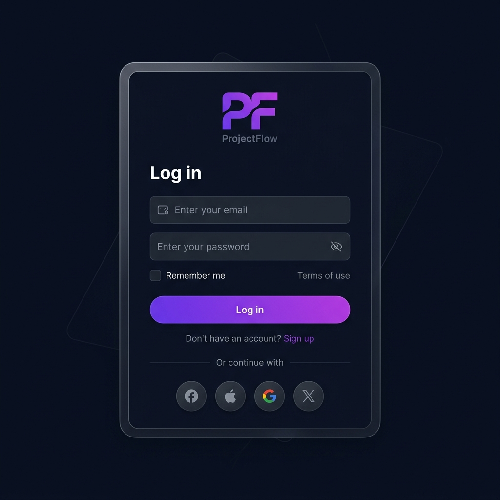

<p align="center">
  
  
  
  
  
</p>

<h1 align="center">🚀 ProjectFlow — SDLC Command Center</h1>

<p align="center">
  <strong>A modern, full-stack project management dashboard built for tracking software development lifecycle (SDLC) stages, tasks, and team collaboration — all from one sleek dark-themed interface.</strong>
</p>

<br />

<p align="center">
  
</p>

---

## ✨ Features

### 🎯 Core Dashboard
- **Real-time Metrics** — Track total projects, average progress, at-risk items, and upcoming deadlines at a glance
- **Interactive Project Cards** — Select, search, and filter projects by SDLC stage with smooth animations
- **Detail Panel** — View project goals, owner, progress, due dates, and timeline health indicators

### 🔄 SDLC Lifecycle Tracking
- **7-Stage Pipeline** — Planning → Requirements → Design → Development → Testing → Deployment → Maintenance
- **Stage Advancement** — Move projects through the SDLC pipeline with a single click
- **Visual Stage Map** — See project distribution across all lifecycle stages

### ✅ Kanban Task Board
- **Three-Column Board** — Backlog, In Progress, and Done
- **Quick Task Movement** — Move tasks between columns with arrow buttons
- **Activity Logging** — Every task action is automatically logged in the project updates

### 👥 Team Collaboration
- **Role-Based Access** — Managers own and configure projects; Employees contribute tasks and updates
- **Member Management** — Invite employees by email and manage team assignments
- **Shared Visibility** — Team members see only the projects they're assigned to

### 🔐 Authentication System
- **Email/Password Auth** — Full sign-up and login flow with JWT tokens
- **Google OAuth** — One-click sign-in via Google Identity Services (configurable)
- **Demo Mode** — Quick demo login for instant exploration
- **Session Persistence** — "Remember me" support with localStorage

<p align="center">
  
</p>

### 🎨 Premium UI/UX
- **Dark Glassmorphism** — Frosted glass panels with backdrop blur effects
- **Animated Backgrounds** — Floating gradient orbs that pulse and shift
- **Micro-Animations** — Smooth fade-ups, hover transforms, and count-up animations
- **Responsive Design** — Fully adaptive layout from desktop to mobile

---

## 🛠️ Tech Stack

| Layer | Technology |
|-------|-----------|
| **Frontend** | Vanilla HTML5, CSS3 (Glassmorphism, CSS Grid, Flexbox), ES6+ JavaScript |
| **Backend** | Node.js + Express 5 |
| **Auth** | JWT (jsonwebtoken) + Google OAuth 2.0 |
| **Storage** | Local JSON file storage (default) or Google Cloud Storage (configurable) |
| **Typography** | [Inter](https://fonts.google.com/specimen/Inter) via Google Fonts |
| **Avatars** | [DiceBear](https://dicebear.com/) initials API |

---

## 📦 Getting Started

### Prerequisites

- **Node.js** 18+ and **npm** installed on your machine

### Installation

```bash
# 1. Clone the repository
git clone https://github.com/aditya1282/project-management-frontend.git

# 2. Navigate to the project directory
cd project-management-frontend

# 3. Install dependencies
npm install

# 4. Start the server
npm start
```

The app will be running at **http://localhost:3000** 🎉

### Quick Demo

Click **"Or sign in as Demo User"** on the login screen to instantly explore the dashboard with pre-loaded sample data.

---

## ⚙️ Configuration

Create a `.env` file in the root directory to configure optional features:

```env
# Server
PORT=3000

# JWT Secret (change in production!)
JWT_SECRET=your-super-secret-key

# Google OAuth (optional)
GOOGLE_CLIENT_ID=your-google-client-id

# Google Cloud Storage (optional — defaults to local file storage)
GCS_BUCKET_NAME=your-bucket-name
GOOGLE_APPLICATION_CREDENTIALS=/path/to/service-account.json
```

> **Note:** All features work out of the box with local storage. Cloud and OAuth configurations are optional for production deployment.

---

## 📂 Project Structure

```
project-management-frontend/
├── index.html          # Main HTML — login screen + dashboard shell
├── styles.css          # Complete design system — dark theme, glassmorphism, animations
├── app.js              # Frontend logic — auth, rendering, API calls, event handling
├── server.js           # Express API — auth endpoints, CRUD operations, middleware
├── db.js               # Data layer — local JSON or Google Cloud Storage abstraction
├── package.json        # Dependencies and scripts
├── .gitignore          # Git ignore rules
├── screenshots/        # README preview images
│   ├── dashboard.png
│   └── login.png
└── data/               # Runtime data (auto-generated, git-ignored)
    ├── projects.json
    └── users.json
```

---

## 🔌 API Endpoints

### Authentication
| Method | Endpoint | Description |
|--------|----------|-------------|
| `GET` | `/api/auth/config` | Get Google OAuth client ID |
| `POST` | `/api/auth/signup` | Register a new user |
| `POST` | `/api/auth/login` | Log in with email/password |
| `POST` | `/api/auth/google` | Google OAuth sign-in |
| `POST` | `/api/auth/mock` | Demo/mock sign-in |

### Projects (🔒 Authenticated)
| Method | Endpoint | Description |
|--------|----------|-------------|
| `GET` | `/api/projects` | Fetch user's visible projects |
| `POST` | `/api/projects` | Create a new project |
| `PUT` | `/api/projects/:id` | Update project details |
| `DELETE` | `/api/projects/:id` | Delete a project |

### Collaboration (🔒 Authenticated)
| Method | Endpoint | Description |
|--------|----------|-------------|
| `GET` | `/api/users` | List registered users |
| `PUT` | `/api/projects/:id/members` | Add employee to project |
| `DELETE` | `/api/projects/:id/members` | Remove employee from project |
| `POST` | `/api/projects/:id/tasks` | Add a task |
| `PUT` | `/api/projects/:id/tasks/:taskId` | Move/update a task |
| `POST` | `/api/projects/:id/updates` | Add a project log entry |

---

## 🚀 Deployment

The app is ready to deploy on any Node.js hosting platform:

- **Railway** / **Render** / **Fly.io** — Connect your repo and set `npm start` as the start command
- **Google Cloud Run** — Pair with GCS bucket for persistent cloud storage
- **Heroku** — Set `PORT` env var and push

---

## 🤝 Contributing

Contributions are welcome! Feel free to:

1. Fork the repository
2. Create a feature branch (`git checkout -b feature/amazing-feature`)
3. Commit your changes (`git commit -m 'Add amazing feature'`)
4. Push to the branch (`git push origin feature/amazing-feature`)
5. Open a Pull Request

---

## 📄 License

This project is licensed under the **ISC License** — see the [LICENSE](LICENSE) file for details.

---

<p align="center">
  <strong>Built with ❤️ by Aditya Sharma</strong>
  <br />
  <sub>If you found this project useful, consider giving it a ⭐</sub>
</p>
